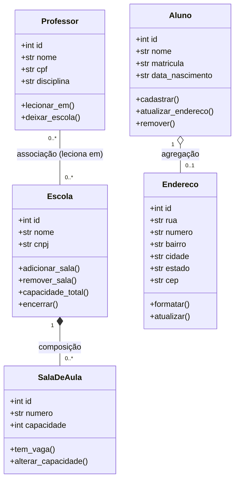

# Trabalho Prático 01 — Sistema Escolar (Arquitetura de Software)

Implementação em **Python + FastAPI**.

## Como executar

```bash
pip install -r requirements.txt
uvicorn main:app --reload
```

Documentação interativa (Swagger): http://127.0.0.1:8000/docs

---

## 1. Entidades, atributos e métodos

| Classe | Atributos | Métodos |
|---|---|---|
| **Escola** | id, nome, cnpj, salas, professores | adicionar_sala(), remover_sala(), buscar_sala(), capacidade_total(), encerrar() |
| **SalaDeAula** | id, numero, capacidade | tem_vaga(), alterar_capacidade() |
| **Professor** | id, nome, cpf, disciplina, escolas | lecionar_em(), deixar_escola(), desvincular_de_todas() |
| **Aluno** | id, nome, matricula, data_nascimento, endereco | cadastrar(), atualizar_endereco(), remover() |
| **Endereco** | id, rua, numero, bairro, cidade, estado, cep | formatar(), atualizar() |

## 2. Classificação das relações

| Relação | Tipo | Justificativa |
|---|---|---|
| Escola — SalaDeAula | **Composição** (◆) | A sala não faz sentido sem a escola: nasce dentro dela e, se a escola fecha, deixa de existir no sistema. A escola é a única "dona" (exclusividade do todo) e as salas não têm existência independente. |
| Professor — Escola | **Associação** (linha simples) | Relação muitos-para-muitos (um professor leciona em várias escolas; uma escola tem vários professores). Nenhum é "parte" do outro e a existência de um não depende da do outro. |
| Aluno — Endereço | **Agregação** (◇) | O endereço é criado junto com o aluno e pertence a ele (relação todo-parte), porém, se o aluno for removido, o endereço continua fazendo sentido isoladamente (relatórios), sendo repassado a outro contexto. Logo, o ciclo de vida da parte **não** está preso ao do todo. |

## 3. Diagrama de classes UML



## 4. Como a implementação reflete cada relação

- **Composição:** `Escola.adicionar_sala()` é o único meio de criar uma `SalaDeAula`; as salas ficam em `_salas` (sem repositório próprio). `DELETE /escolas/{id}` destrói as salas (`GET /salas` deixa de listá-las).
- **Associação:** `Professor` e `Escola` guardam apenas referências um ao outro (`POST/DELETE /professores/{id}/escolas/{id}`). Remover um lado só desfaz o vínculo; o outro continua existindo.
- **Agregação:** `Aluno.cadastrar()` cria o `Endereco` junto com o aluno. Em `DELETE /alunos/{id}` o endereço é devolvido e passa a existir em `GET /enderecos-avulsos`.

## 5. Roteiro rápido de teste (Swagger)

1. `POST /escolas` → `POST /escolas/1/salas` (crie 2 salas).
2. `POST /professores` → vincule a duas escolas com `POST /professores/{id}/escolas/{id}`.
3. `DELETE /escolas/1` → salas destruídas, professor permanece.
4. `POST /alunos` → `DELETE /alunos/{id}` → consulte `GET /enderecos-avulsos`.
